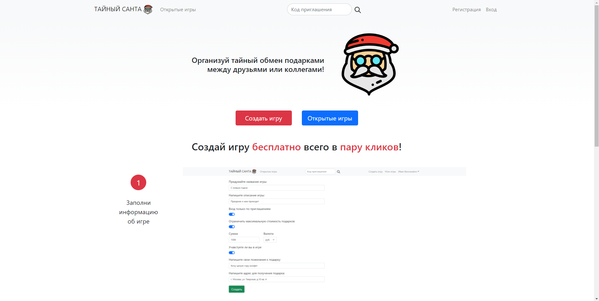

# Secret Santa

---

Secret Santa is a game in which group participants pair up and exchange gifts anonymously.
This application has developed to help you play this game online!

## Used technologies

---

- HTML5, CSS, JS, [Bootstrap](https://getbootstrap.com/)
- [React](https://reactjs.org/)
- [Node.js](https://nodejs.org/en/)
- [Express](https://expressjs.com/)
- [PostgreSQL](https://www.postgresql.org/)
- [npm](https://www.npmjs.com/)

## How to run it on your computer

---

- Install [Node.js](https://nodejs.org/en/), [npm](https://www.npmjs.com/) и [PostgreSQL](https://www.postgresql.org/)
- Clone this repository
- In the file `./server/.env` change DB access variables:
- - `DB_NAME`
- - `DB_USER`
- - `DB_PASSWORD`
- - `DB_HOST`
- - `DB_PORT`
- Optionally change the secret key for encrypting/decrypting JWT tokens `JWT_SECRET_KEY`
- In the file `./client/.env` change variable `REACT_APP_API_URL` - адрес сервера
- In the file `./server` run the server application by typing in terminal `node index.js`
- In the file `./client` run the client application by typing in terminal `npm start`
- Go to your browser and type `http://localhost:3000/`

## Website pages

---

- `/` - main page
- `/registration` - registration page
- `/login` - login page
- `/lobbies` - page with open lobbies
- `/lobbies/invite/INVITE_CODE` - lobby invitation page, where `INVITE_CODE` - invite code
- `/lobbies/new` - lobby creation page
- `/lobbies/my` - page with a list of lobbies in which the user participates as a player or as a creator
- `/account` - user info edit page

